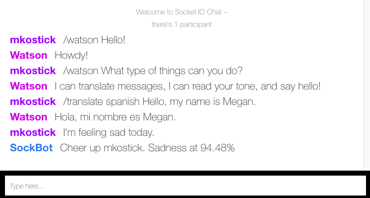

# watsonSocketBot

## Prequisites
1. [Bluemix Account](https://console.bluemix.net/)
2. [Bluemix CLI](https://clis.ng.bluemix.net/ui/home.html)
3. [Github Account](https://github.com/)
4. [Git](https://git-scm.com/downloads)

## Steps
### 1. Clone repo
1. Git clone this sample project

`$    git clone git@github.com:kostickm/watsonSocketBot.git`

2. Change to your the newly cloned repo

`$    cd watsonSocketBot/`

### 2. Create Watson Services

#### Watson Conversation Service
1. Create [service](https://console.bluemix.net/catalog/services/conversation) in Bluemix named `conversation`
2. Click `Launch tool`. This will open the Conversation UI.
3. Import the `workspace-example.json` file located in your locally cloned `watsonSocketBot` directory
4. On your newly imported workspace click `View details` and save your `Workspace ID`

#### Watson Language Translator Service
1. Create [service](https://console.bluemix.net/catalog/services/language-translator) in Bluemix named `language-translator`

#### Watson Tone Analyzer Service
1. Create [service](https://console.bluemix.net/catalog/services/tone-analyzer) in Bluemix named `tone-analyzer`

### 3. Update Configuration
1. Replace `<workspace_id>` with your Watson Conversation Workspace ID in your local `app.js` file

```javascript
  /***********************************************************************
  Watson Socket
  ************************************************************************/
  socket.on('watson', function (data) {

      console.log('Watson socket called');

      const payload = {
        workspace_id: process.env.WORKSPACE_ID || '<workspace_id>',
        input: { text: data.message },
        context: context,
      };
```

### 4. Deploy App to Bluemix
You are now ready to deploy your application to Bluemix.

*Note: You may also use the shorthand command `bx` instead of `bluemix`.*

1. Log into Bluemix CLI using your Bluemix credentials

  `$    bluemix api https://api.ng.bluemix.net`

  `$    bluemix login`

2. From your local app directory deploy your app to Bluemix

  `$    bluemix app push <YOUR_APP_NAME>`

### 5. Start chatting with Watson
Once your app has finished deploying, you are ready to start chatting.

1. From your Bluemix `Dashboard`, find your deployed app and click the assigned URL route.

2. Enter a nickname, select a language, and hit `return` to enter the chatroom.

#### Commands
```
* Chat with Watson *
/watson <text>

Sample commands:
/watson Hey there!
/watson What can you do?

* Have Watson translate text *
/translate <language> <text_to_translate>

Sample commands:
/translate spanish My name is Megan
/translate french Hello

* Analyze the tone of all messages *
All messages are analyzed looking for Angry or Sad text.
```

#### Chat Sample


## Next Steps
 * Update Watson Conversation Workspace with new Intents, Entities, and Dialog Flow.
 * Add in an additional Watson service. Find examples [here](https://github.com/watson-developer-cloud).


